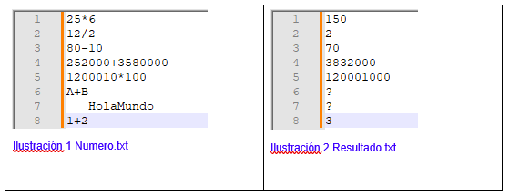

# Fundamentos de C#
Desarrollar un programa en C# que realice las siguientes operaciones

# Proceso:
Leer un archivo de texto llamado **Numero.txt** que contiene líneas con la siguiente estructura:
1. **Numero1**operador**Numero2**. Los operadores validos son: +(suma),-(resta),*(multiplicación) y / (división).
1. Realizar la operación matemática correspondiente a cada línea.
1. Escribir el resultado de cada operación en nuevo archivo de texto llamado **Resultado.txt**.

# Consideraciones
1. El programa debe ser interactivo, permitiendo al usuario ingresar el nombre del archivo de entrada y del archivo de salida por consola.
1. Cada línea del archivo de entrada contendrá un número seguido por un operador matemático y luego otro número (ejemplo **“5+3”**, **“200-100”**)
1. Los números para procesar son enteros, trate de trabajar con tipos de datos LONG (para enteros) para evitar desbordamiento en la memoria.
1. Se espera que el programa realice las operaciones matemáticas según las especificaciones y que maneje posibles errores de formato o calculo
1. En caso de que el programa no logre realizar un cálculo, en el archivo de resultado se debe colocar el signo de interrogación 

# Evaluación
1. Funcionamiento correcto del programa
1. Correcta lectura del archivo de texto de entrada y escritura en el archivo de salida.
1. Manejo adecuado de errores y excepciones.
1. Claridad y organización del código.
1. Cumplimiento de buenas prácticas de programación en C#.

# Ejemplo

